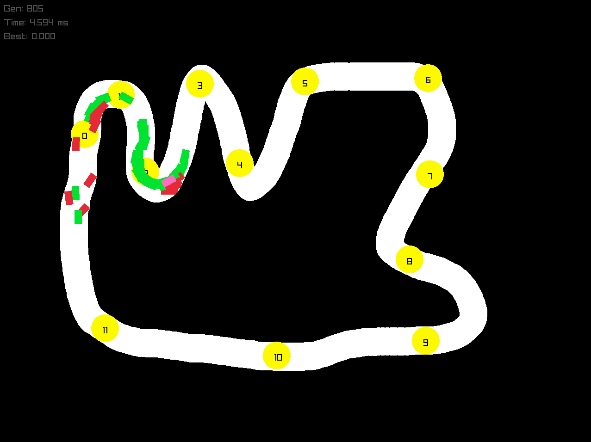
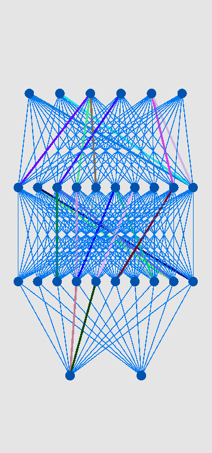

# 🚗 AI Learn to Drive

<div align="center">

### 🧠 Teaching an AI how to drive — one generation at a time

A 2D self-driving car simulation built with **C++**, **raylib**, **CMake**.

The goal of this project is to experiment with artificial intelligence by creating cars that can perceive a track, make driving decisions, and progressively improve their behaviour.

<br>


<br>

**[📦 Repository](https://github.com/vnzoloboy09/AI_Learn_to_drive)**

</div>

# 📸 Demo
<p float="left">
  
  
</p>


# 🧠 How It Works

The basic idea is to treat every car as an **AI agent**.

Each car receives information about its surroundings through sensors. That information is passed into its neural network, which produces driving decisions.

A simplified pipeline looks like this:

```text
┌─────────┐    ┌─────────────┐    ┌───────────────┐    ┌──────────────┐
│  Track  │───►│ Car Sensors │───►│Neural Network │───►│   Driving    │
└─────────┘    └─────────────┘    └───────────────┘    │   Decisions  │
                                                       └───────┬──────┘
                                                               │
                                                               ▼
               ┌───────────────┐    ┌─────────────┐    ┌─────────────────┐
               │New Generation │◄───│  Fitness    │◄───│    Car Moves    │
               │Mutation/Select│    │ Evaluation  │    │                 │
               └───────────────┘    └─────────────┘    └─────────────────┘
```
# 🔨 Build

From the project root:
```console
cmake -S . -B build
cmake --build build
```
For a Release build:
```console
cmake -S . -B build -DCMAKE_BUILD_TYPE=Release
cmake --build build --config Release
```
# Run
Windows
```powershell
.\build\AI_Learn_to_drive.exe
```
Linux / macOS
````md
./build/AI_Learn_to_drive
````

<div align="center">

### 🚗💨 Let the cars learn.

**Built with C++ • raylib • CMake**

<br>

⭐ If you find this project interesting, consider giving it a star!

</div>
